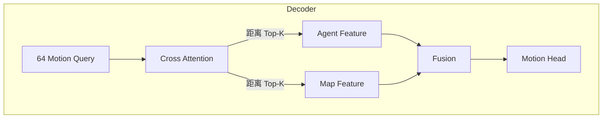
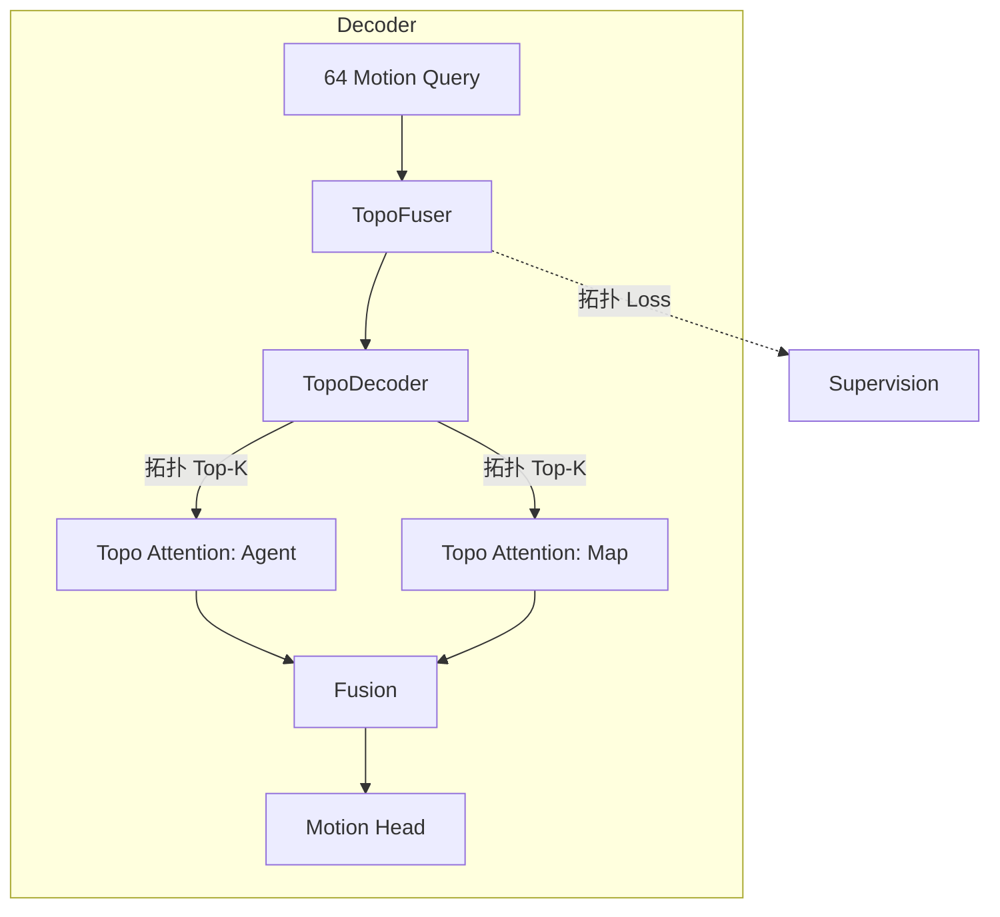

# MTR vs MTR++ vs BeTop 架构对比详解

本文档详细对比了仓库中三种模型的架构差异，帮助理解它们之间的继承和创新关系。

---

## 1. 整体架构对比

| 模型 | 论文 | Encoder | Decoder | 核心创新 |
|------|------|---------|---------|----------|
| **MTR** | ICLR 2023 | MTREncoder | (不在本仓库) | 首个场景级 Motion Query |
| **MTR++** | CVPR 2024 | MTRPPEncoder | MTRPPDecoder | 相对位置编码 + 联合预测 |
| **BeTop** | NeurIPS 2024 | MTREncoder | BeTopDecoder | 拓扑推理 (Braid Theory) |

---

## 2. Encoder 对比

### 2.1 MTREncoder vs MTRPPEncoder

| 特性 | MTREncoder | MTRPPEncoder |
|------|------------|--------------|
| **位置编码** | 绝对正弦编码 | 相对位置编码 (RPE) |
| **坐标系** | Agent-Centric (单个中心对象) | 每个 Polyline 独立旋转 |
| **代码标记** | 默认实现 | `(Deprecated)` 标记 |

#### MTREncoder (简洁版)

```python
# mtr_encoder.py - 核心逻辑
def apply_local_attn(self, x, x_mask, x_pos, num_of_neighbors):
    # 1. KNN 选择邻居
    index_pair = knn_utils.knn_batch_mlogk(x_pos_stack, ...)
    
    # 2. 绝对位置编码
    pos_embedding = gen_sineembed_for_position(x_pos_stack[None, :, 0:2])
    
    # 3. Local Self-Attention
    for layer in self.self_attn_layers:
        output = layer(src=output, pos=pos_embedding, index_pair=index_pair)
```

#### MTRPPEncoder (增强版)

```python
# mtr_plus_plus_encoder.py - 核心逻辑
def apply_local_attn(self, x, x_mask, x_pos, num_of_neighbors):
    # 1. KNN 选择邻居
    index_pair = knn_utils.knn_batch_mlogk(x_pos_stack, ...)
    
    # 【MTR++ 新增】2. 计算相对位置 (RPE)
    if self.joint_encode:
        query_attn_pos = grouping_operation(x_pos_stack, batch_cnt, index_pair)
        rel_attn_pos = query_attn_pos - x_pos_stack[:, None, :]  # 相对位置
        
        # 旋转到局部坐标系
        new_x = cos * rel_x + sin * rel_y
        new_y = -sin * rel_x + cos * rel_y
        rel_pos = torch.stack([new_x, new_y, cos(rel_heading), sin(rel_heading)])
        
        pos_embedding = gen_sineembed_for_position(rel_pos)  # 相对位置编码
    
    # 3. Local Self-Attention with RPE
    for layer in self.self_attn_layers:
        output = layer(src=output, pos=abs_pos_embedding, rpe_distance=pos_embedding)
```

#### MTR++ Encoder 独有特性

1. **局部坐标归一化 (`poly_rotate_along_z`)**
   - 每条 Polyline 独立旋转，使其朝向对齐
   - 目的：让模型学习"车道线在我左边/右边"，而不是"车道线朝东/朝西"

2. **相对位置编码 (RPE)**
   - 计算每对 Token 的相对位置和相对朝向
   - 让 Attention 权重直接感知"你在我前方 10 米"

---

## 3. Decoder 对比

### 3.1 MTRPPDecoder vs BeTopDecoder

| 特性 | MTRPPDecoder | BeTopDecoder |
|------|--------------|--------------|
| **拓扑推理** | ❌ 没有 | ✅ TopoFuser + TopoDecoder |
| **KV 选择方式** | 距离 Top-K | 拓扑分数 Top-K |
| **联合预测** | ✅ `joint_decode` | ❌ 单对象预测 |
| **损失函数** | GMM + Vel + Cls | GMM + Vel + Cls + **Topo** |

### 3.2 核心差异：如何选择要关注的 Agent/Map

#### MTRPPDecoder (基于距离)

```python
# mtr_plus_plus_decoder.py - apply_dynamic_map_collection
def apply_dynamic_map_collection(self, map_pos, pred_waypoints, ...):
    # 选择策略 1：自车周围的地图 (基于距离)
    base_dist = (map_pos - base_points).norm(dim=-1)
    base_map_idxs = base_dist.topk(k=256, largest=False)  # 最近的 256 条
    
    # 选择策略 2：预测轨迹沿途的地图 (基于距离)
    dynamic_dist = (pred_waypoints - map_pos).norm(dim=-1).min()
    dynamic_map_idxs = dynamic_dist.topk(k=128, largest=False)  # 最近的 128 条
    
    return torch.cat([base_map_idxs, dynamic_map_idxs])  # 共 384 条
```

> **问题**：如果一个障碍物离得远但会和自己轨迹交叉，基于距离选不到它！

#### BeTopDecoder (基于拓扑分数)

```python
# betop_decoder.py - apply_topo_reasoning + agent_topo_indexing
def apply_transformer_decoder(self, ...):
    # 【BeTop 核心创新】Step 1: 预测拓扑分数
    actor_topo_feat, actor_topo_preds, full_actor_topo_preds = self.apply_topo_reasoning(
        query_feat=query_content,  # [64, B, D]
        kv_feat=obj_feature,        # [B, N, D]
        fuse_layer=self.actor_topo_fusers[layer_idx],
        decoder_layer=self.actor_topo_decoders[layer_idx],
    )
    # full_actor_topo_preds: [B, 64, N, 1] - 拓扑分数矩阵
    
    # Step 2: 根据拓扑分数选择 Top-K
    pred_agent_topo_idx = agent_topo_indexing(
        full_actor_topo_preds, obj_mask, max_agents=32
    )
    # pred_agent_topo_idx: [B, 64, 32] - 每个 Query 选 32 个拓扑相关的 Agent
    
    # Step 3: 稀疏 Attention (只关注选中的 Agent)
    agent_query_feature = self.apply_cross_attention(
        ...,
        topo_indexing=pred_agent_topo_idx,  # 关键：用拓扑索引
    )
```

> **优势**：即使障碍物离得远，只要拓扑分数高（模型预测它会和自己交叉），就会被选中！

---

## 4. 联合预测 (Joint Prediction) - MTR++ 独有

MTR++ 支持同时预测**多个对象**的轨迹，并考虑它们之间的交互。

```python
# MTRPPDecoder - 联合预测模式
if self.joint_decode:
    # 所有待预测对象共享场景特征
    intention_query = intention_query.reshape(b, num_query * num_center, d_model)
    
    # 对象之间通过 Self-Attention 交互
    query_feature = attention_layer(
        ...,
        sa_index_pair=index_pair,  # 对象间的邻居关系
        sa_rpe_distance=pos_embedding,  # 相对位置编码
    )
```

BeTop 不使用联合预测模式，而是依靠拓扑推理隐式建模交互。

---

## 5. 损失函数对比

| 损失项 | MTRPPDecoder | BeTopDecoder |
|--------|--------------|--------------|
| `loss_reg_gmm` | ✅ GMM 负对数似然 | ✅ |
| `loss_reg_vel` | ✅ 速度 L1 Loss | ✅ |
| `loss_cls` | ✅ Cross Entropy | ✅ Binary CE |
| `loss_dense` | ✅ Dense Future | ✅ |
| **`loss_topo`** | ❌ | ✅ 拓扑 Loss (actor + map) |

#### BeTop 拓扑 Loss

```python
# betop_decoder.py - topo_loss
def topo_loss(self, actor_topo, actor_topo_mask, ...):
    # actor_topo: [B, 1, N, T] - Ground Truth 拓扑标签 (Braid 编码)
    # actor_topo_pred: [B, 1, N, 1] - 预测的拓扑分数
    
    actor_topo_loss = loss_utils.topo_loss(
        actor_topo_pred, actor_topo.detach(),
        actor_topo_mask.float().detach(),
        top_k=True, top_k_ratio=0.25  # 只计算 Top 25% 难例的 Loss
    )
```

---

## 6. 数据流对比图

### MTRPPDecoder



### BeTopDecoder



---

## 7. 配置文件对应关系

| 配置文件 | Encoder | Decoder |
|----------|---------|---------|
| `BeTopNet_full_64.yaml` | MTREncoder | BeTopDecoder |
| `MTR_PlusPlus.yaml` | MTRPPEncoder | MTRPPDecoder |

```yaml
# BeTopNet_full_64.yaml
MODEL:
    ENCODER:
        NAME: MTREncoder       # 使用基础 Encoder
    DECODER:
        NAME: BeTopDecoder     # 使用拓扑 Decoder
        NUM_TOPO: 32           # 拓扑选择的 Agent 数量

# MTR_PlusPlus.yaml
MODEL:
    ENCODER:
        NAME: MTRPPEncoder     # 使用增强 Encoder (RPE)
        JOINT_DECODE: True     # 启用联合编码
    DECODER:
        NAME: MTRPPDecoder     # 使用原版 Decoder
        JOINT_DECODE: True     # 启用联合预测
```

---

## 8. 总结：三者关系

```
MTR (原版)
  │
  ├──→ MTR++ (增强)
  │      ├── Encoder: +相对位置编码 (RPE)
  │      └── Decoder: +联合预测 (Joint Decode)
  │
  └──→ BeTop (本仓库核心创新)
         ├── Encoder: 复用 MTR Encoder
         └── Decoder: +拓扑推理 (TopoFuser + TopoDecoder)
```

**一句话总结**：
- **MTR++** 的创新在 Encoder (相对位置编码) + 联合预测
- **BeTop** 的创新在 Decoder (拓扑推理 + 拓扑 Attention)
