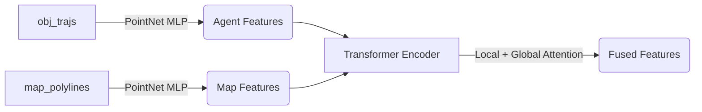
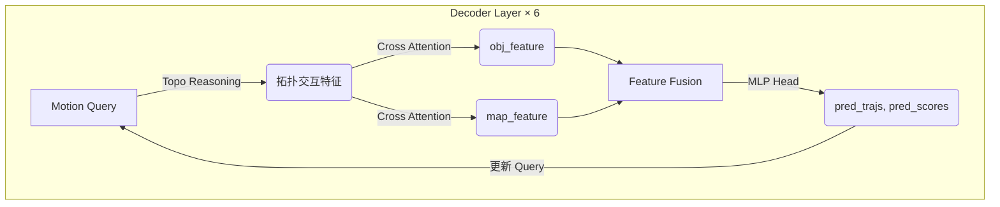
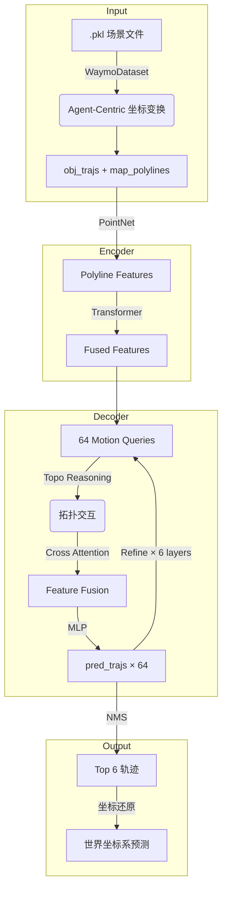

# BeTop 仓库详细解析

## 1. 仓库概览

BeTop 是一个用于 **自动驾驶运动预测 (Motion Prediction)** 的模型，基于 Waymo Open Motion Dataset (WOMD)。核心创新是通过 **拓扑推理 (Topological Reasoning)** 建模多智能体的交互行为。

| 任务定义 | 数值 |
|---------|------|
| 输入：过去轨迹 | **1.1 秒** (11 帧 × 0.1s) |
| 输出：预测轨迹 | **8 秒** (80 帧 × 0.1s) |
| 预测模态数量 | 6 条候选轨迹 |
| 采样频率 | 10 Hz |

---

## 2. 目录结构

```
womd/
├── tools/                      # 🚀 执行入口
│   ├── cfg/                    # 配置文件 (.yaml)
│   │   └── BeTopNet_full_64.yaml
│   ├── train.py                # 训练脚本
│   ├── test.py                 # 测试脚本
│   └── submission.py           # 生成提交文件
│
├── betopnet/                   # 🧠 核心源码
│   ├── datasets/waymo/         # 数据加载
│   │   └── waymo_dataset.py    # 场景数据处理 (关键)
│   │
│   ├── models/                 # 模型架构
│   │   ├── betopnet.py         # 模型入口
│   │   ├── encoder/mtr_encoder.py
│   │   └── decoder/betop_decoder.py
│   │
│   ├── ops/                    # CUDA 算子 (KNN, Attention)
│   └── utils/                  # 工具函数
```

---

## 3. Pipeline 详解

### 3.1 数据加载阶段 (`waymo_dataset.py`)

#### 输入格式
- 预处理后的 `.pkl` 文件，包含场景中所有障碍物的轨迹和地图信息。

#### 坐标系变换 (Agent-Centric)

> [!IMPORTANT]
> **朝向对齐 (Heading Alignment)**：将场景旋转，使预测对象的行驶方向指向 X 轴正方向。这样模型看到的输入始终是"我面向正前方"，提高学习效率。

```python
# 旋转公式 (所有坐标按中心对象朝向旋转)
rotated_points = rotate(points, angle=-center_heading)
```

#### 输出的 Batch 数据结构

| Key | Shape | 说明 |
|-----|-------|------|
| `obj_trajs` | `[B, N_agents, 11, 29]` | 历史轨迹特征 (过去 1.1s) |
| `obj_trajs_mask` | `[B, N_agents, 11]` | 有效帧掩码 |
| `map_polylines` | `[B, 768, 20, 9]` | 地图车道线 (768条 × 每条20个点) |
| `center_gt_trajs` | `[B, 80, 4]` | Ground Truth 轨迹 (x, y, vx, vy) |

#### 29 维 Agent 特征构成

| 维度 | 内容 |
|------|------|
| 0-5 | 位置 (x, y, z) + 尺寸 (dx, dy, dz) |
| 6-10 | One-Hot: [Vehicle, Pedestrian, Cyclist, IsCenter, IsSDC] |
| 11-21 | 时间编码 (11 帧 One-Hot) |
| 22-23 | 朝向 (sin, cos) |
| 24-25 | 速度 (vx, vy) |
| 26-27 | 加速度 (ax, ay) |
| 28 | 有效性掩码 |

---

### 3.2 编码器 (`MTREncoder`)



#### 核心操作
1. **Polyline Encoder**：使用 MLP 将离散点序列编码为向量。
2. **Transformer Self-Attention**：Agent 和 Map Token 之间进行信息交换 (6 层)。
3. **Local Attention**：使用 KNN 限制注意力范围，减少计算量 (邻居数 = 16)。

#### 输出
| Key | Shape | 说明 |
|-----|-------|------|
| `obj_feature` | `[B, N_agents, 256]` | 增强后的障碍物特征 |
| `map_feature` | `[B, N_map, 256]` | 增强后的地图特征 |
| `center_objects_feature` | `[B, 256]` | 中心对象特征 |

---

### 3.3 解码器 (`BeTopDecoder`)

#### 核心机制：Motion Query

使用 **64 个 Intention Points**（K-Means 聚类的目标点）作为 Query，通过 6 层 Transformer Decoder 细化轨迹预测。



#### BeTop 创新：拓扑推理 (Topo Reasoning)

> [!NOTE]
> **Braid Theory**：用辫子理论描述多车交互（如超车 = 轨迹交叉模式）。模型显式预测"谁在谁前面"、"从左边还是右边绕过"等拓扑关系。

| 模块 | 作用 |
|------|------|
| `TopoFuser` | 融合 Query 和 KV 特征，生成拓扑表示 |
| `TopoDecoder` | 预测拓扑分数 (Agent/Map 级别) |
| `agent_topo_indexing` | 根据拓扑分数选择最相关的 Agent |
| `map_topo_indexing` | 根据拓扑分数选择最相关的 Map Polyline |

#### 输出 (每层 Decoder)
| Key | Shape | 说明 |
|-----|-------|------|
| `pred_trajs` | `[B, 64, 80, 7]` | 64 条候选轨迹，每条 80 帧，7 维 (x, y, σx, σy, ρ, vx, vy) |
| `pred_scores` | `[B, 64]` | 每条轨迹的置信度 (logits) |

---

### 3.4 损失函数

| 损失类型 | 权重 | 说明 |
|----------|------|------|
| `loss_cls` | 1.0 | 分类损失：哪个模态最接近真值 (BCE) |
| `loss_reg_gmm` | 1.0 | 回归损失：GMM 负对数似然 |
| `loss_reg_vel` | 0.5 | 速度回归损失 (L1) |
| `loss_topo` | 100 | 拓扑损失：交互关系预测 |

---

### 3.5 推理输出

#### 后处理
1. **NMS (非极大值抑制)**：从 64 条候选轨迹中选出最优的 6 条。
2. **坐标还原**：将局部坐标系的预测结果旋转平移回世界坐标系。

#### 最终输出
| Key | Shape | 说明 |
|-----|-------|------|
| `pred_trajs` | `[N_agents, 6, 80, 2]` | 6 条轨迹，每条 80 帧 (x, y) |
| `pred_scores` | `[N_agents, 6]` | 归一化后的概率 |

---

## 4. 总结流程图


